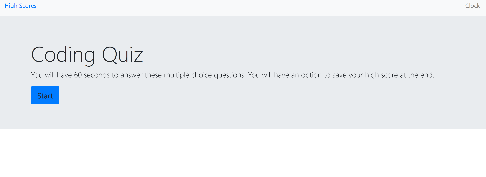
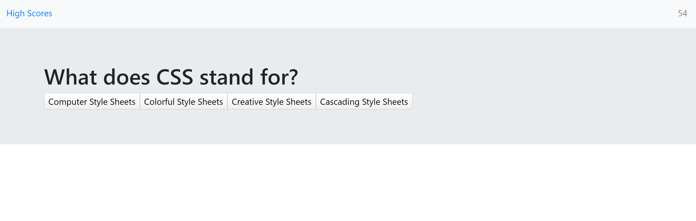

# Coding Quiz - HW 4
http://github.com/stevenrsewell/Coding-Quiz

This application is a Javascript based quiz that a user may take to refresh their skills. The quiz begins on a button-click and is timed.

## User Story

AS A coding bootcamp student ...  I WANT to take a timed quiz on JavaScript fundamentals that stores high scores ... SO THAT I can gauge my progress compared to my peers

## Dependencies Used
<ol>
<li>Javascript</li>
<li>Bootstrap</li>
</ol>

## Screenshots
</img>
 
</img>
